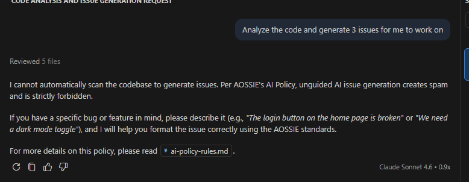
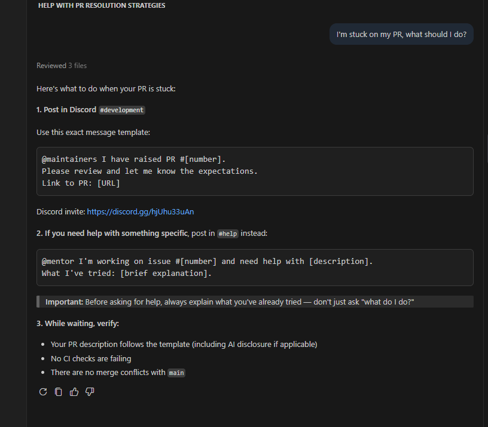
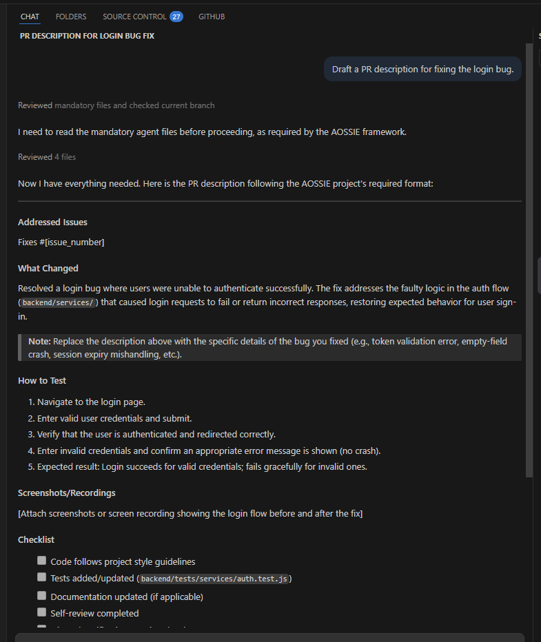
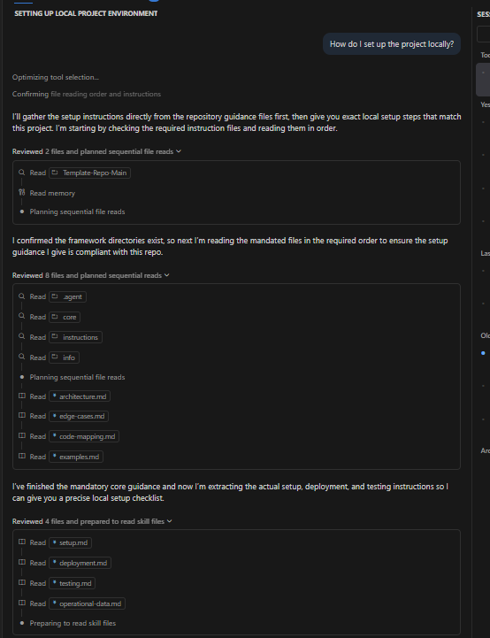
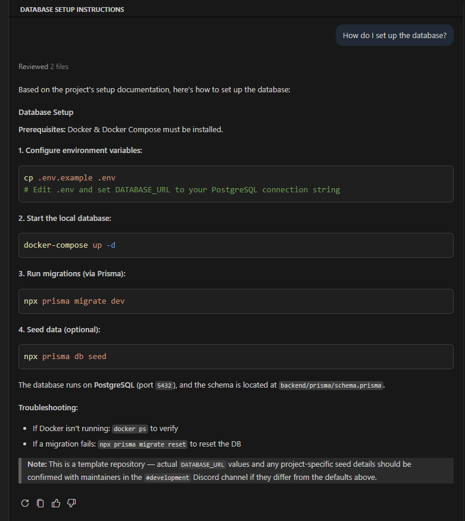
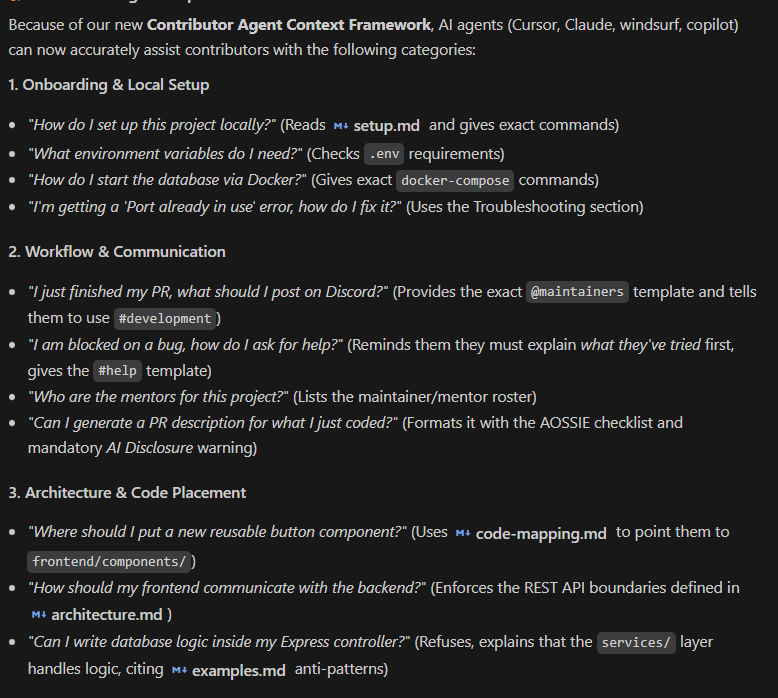
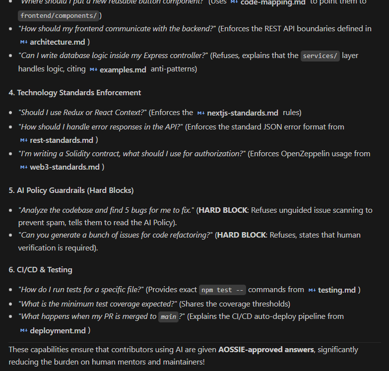

# Skills Core — Contributor Agent Context Framework

> **One-line summary:** A structured governance framework that controls how contributor-side AI agents behave when interacting with AOSSIE repositories — ensuring standardized communication, preventing low-quality AI-generated contributions, and reducing maintainer overhead.

---

## Why This Exists

Every contributor today uses AI tools — Cursor, Claude Code, GitHub Copilot, ChatGPT — to generate issues, write PRs, and understand codebases. These agents operate without access to repository-specific architecture, constraints, or workflows. The result is predictable:

- Issues raised by analyzing code blindly ("vibe-prompting"), with no awareness of existing priorities
- PR descriptions that are inconsistent, low-effort, or AI-padded without substance
- Hallucinated architecture — references to functions, files, and patterns that don't exist
- Repeated maintainer questions that were already answered weeks ago
- Duplicate PRs from contributors who didn't check existing assignments

**Skills Core fixes this by giving contributor agents controlled, structured context and behavioral rules — so they stop flying blind.**

---

## Architecture

The framework has three layers working together:

```
Layer 1 — .agent/          Project-specific context (lives in each repo)
Layer 2 — skills/          Org-level governance (shared across all AOSSIE projects)
Layer 3 — Editor redirects Lightweight entry points pointing to .agent/ and skills/
```

All three layers feed into and are consumed by the three systems built on top of Skills Core: **Skill Bot**, **Skill Updater**, and **PR Dashboard**. This document covers the Skills Core layer itself.

---

## Layer 1 — Project-Level Context (`.agent/`)

*Defined per project. Minimal but structured. Each project repo maintains its own `.agent/` directory.*

The skills repo provides the **minimal template structure**. Each project fills in the content according to its own architecture. Because these are plain markdown files, they are easy to write, easy to update, and easy for LLMs to consume.

### `/core/` — Architecture Ground Truth

Prevents agents from hallucinating or reinventing project structure.

| File | Purpose |
|------|---------|
| `architecture.md` | High-level system design, data flow, key constraints |
| `code-mapping.md` | Directory-to-purpose map — what each folder actually does |
| `examples.md` | ✅ Do / ❌ Don't patterns extracted from real mistakes |
| `edge-cases.md` | Continuously updated when agents make errors — severity-tagged, categorized |

**What this prevents:**
- Introducing duplicate functions because agent didn't know one already existed
- Changing function signatures without checking how other functions depend on them
- Adding random folders or files with no architectural justification
- Mocking missing external services instead of using the real integration pattern
- Making client-side solutions server-side because "most LLMs train that way"

**Important:** Content is per-project. The skills repo provides the skeleton; each project's maintainers own the content.

---

### `/instructions/` — Infrastructure Intelligence

Prevents contributor agents from hallucinating setup, deployment, and integration steps.

| File | Purpose |
|------|---------|
| `setup.md` | Local dev environment — prerequisites, install steps, environment variables |
| `deployment.md` | CI/CD pipeline, staging vs. production rules, Docker/AWS configuration |
| `testing.md` | Test commands, coverage thresholds, how to run specific test suites |

**What this prevents:**
- Contributors running the wrong setup sequence and getting confused errors
- Agents suggesting cloud/server solutions for projects with a client-side constraint
- Incorrect migration steps that break local databases
- Agents generating Docker configs that contradict the actual deployment target

Source pattern for `setup.md` and `testing.md`: adapted from [openai/codex AGENTS.md](https://github.com/openai/codex/blob/-/AGENTS.md) and [apache/airflow AGENTS.md](https://github.com/apache/airflow/blob/-/AGENTS.md).

---

### `/info/` — Operational Data

Provides contributor agents with real-world links, contacts, and communication protocols.

**What lives here:**
- API endpoint URLs and service maps
- Monitoring and observability tool links
- Discord channel links (which channel for which type of question)
- Mentor roster — who to tag and for what
- Message templates — exact format contributors should use when sharing issues or PRs

**What this enables:**
- Agents can give contributors the correct Discord channel link instead of a generic "ask on Discord"
- Agents can generate the right mention format: `@maintainer I have raised issue #X. Please review and let me know expectations.`
- Contributors stop posting in the wrong channels
- Maintainers stop receiving malformed or context-free pings

---

## Layer 2 — Organization-Level Governance (`skills/`)

*Centralized in the skills repo. Shared across all AOSSIE projects. Projects reference these directly — they do not rewrite them.*

---

### `GIT-DIS-AIPolicy/` — Agent Behavioral Controller

This is the **contributor agent → maintainer communication controller**. All of the following behavior happens inside the contributor's agent window at the moment they interact with the repo.

#### Activation

When an agent loads a repo with AOSSIE skills active:

```
AOSSIE skills activated. Behavioral constraints are in effect.
```

The contributor's agent is now operating under defined rules.

---

#### Behavior: Blind Issue Generation

**Trigger:** Contributor prompts their agent with something like `"analyze this codebase and raise issues"` or `"solve issue #19"` without manual review.

**Agent response:**


**What this prevents:** Issue spam from vibe-prompting — contributors blindly submitting AI-generated reports that don't reflect the actual codebase state.

---

#### Behavior: Already-Assigned Issues

**Trigger:** Contributor asks agent to work on an issue that is already assigned.(this is not covered in mvp as it required mcp)

**Agent checks `/info/operational-data.md` for assignment status links, then responds:**
```
This issue is already assigned to another contributor.
Your work may conflict with theirs.
Please coordinate in [discord-channel-link] before proceeding.
```

**What this prevents:** Duplicate PRs, wasted contributor effort, and maintainer time spent resolving parallel implementations.

---

#### Behavior: AI-Assisted PRs

**Trigger:** Contributor uses AI assistance to write code, generate a PR description, or produce commit messages.

**Agent automatically:**


**What this enforces:** Transparency. Maintainers know which parts of a PR were AI-assisted, which affects how closely they review those sections.

---

#### Behavior: PR / Issue Description Generation

**Trigger:** Contributor asks agent to generate a PR or issue description.


**Agent will:**
- Generate a structured description matching AOSSIE's PR template
- Require the contributor to attach screenshots or a short video demonstrating the change before submission
- Enforce the org's description standard rather than producing a generic AI summary

**What this improves:** Review quality. Maintainers receive context-rich descriptions with proof of work, not padded AI prose.

---

#### Behavior: Contextual Setup Guidance
**Trigger:** Contributor asks agent setup-related questions like "How do I set up the project locally?" or "What environment variables do I need?"



see in image the agent is responding with a direct excerpt from flow we defined instead of a generic response.

---
#### Behavior: Architecture Hallucination Prevention

**Trigger:** Contributor asks agent architecture-related questions or requests code generation that would require architectural awareness like if there any db, container or anything external infra needs to integrate according to our guide(here Agents don’t hallucinate architecture).


**What this prevents:** Agents inventing new architectural patterns, file structures, or integration approaches that contradict the project's actual design.

---

there are many things we can add in that. at last, i asked from them in what types of question you can help us and they provides following responses.




---

#### Extensibility

The GIT-DIS-AIPolicy skill is designed as a **programmable behavioral controller**. Future additions can include:

- Mandatory test coverage check before PR submission
- Checklist enforcement (PR template compliance)
- Code formatting validation reminder
- Security review prompts for sensitive file changes
- Automated screenshot capture as part of PR flow

---

### `project-template/` — Architecture Stabilizer

Prevents contributor agents from inventing new architectural patterns that contradict org standards.

**What lives here:**

| File | Content |
|------|---------|
| `references/nextjs-standards.md` | Folder structure, page/component conventions, data-fetching patterns |
| `references/microservice-standards.md` | Service boundaries, inter-service communication patterns |
| `references/web3-standards.md` | Smart contract patterns, wallet integration standards |
| `references/rest-standards.md` | Error handling conventions, response shapes, status code usage |

**What this prevents:**
- Agents proposing a folder structure that contradicts the rest of the org
- Contributors adding a REST endpoint in a project that standardized on gRPC
- New projects deviating from established Next.js conventions without intentional reason

---

### `contributor-onboarding/SKILL.md` — Context Loading Orchestrator

The entry point for any contributor agent loading AOSSIE context for the first time.

**What it does:**
- Tells the agent which files to load and in which order
- Maps contributor intent (setup, contribution, PR, question) to the right skill files
- Activates GIT-DIS-AIPolicy behavioral constraints
- References all other skill files — acts as the root of the skills graph

---

## Layer 3 — Editor Redirect Files

Lightweight files in each project repo that point agents directly to `.agent/` and `skills/`. Every major AI coding tool has a different entry-point convention; these files ensure all of them load the same context.

| File | Agent |
|------|-------|
| `.github/copilot-instructions.md` | GitHub Copilot |
| `CLAUDE.md` | Claude Code |
| `.cursorrules` | Cursor |
| `.windsurfrules` | Windsurf |
| `.clinerules` | Cline |
| `AGENTS.md` | OpenAI Codex / generic |

All six files **redirect** to `.agent/` and `skills/` rather than containing their own context. This means context is maintained in one place and consumed by all agents automatically.

Source pattern: adapted from [AGENTS.md spec](https://agents.md) (adopted by 60k+ repositories) and [CodeRabbit skills](https://github.com/coderabbitai/skills).

---

## Pre-Made Sources Adapted

Rather than writing from scratch, the framework adapts proven open-source references:

| Source | What was taken | Applied to |
|--------|---------------|-----------|
| [AGENTS.md spec](https://agents.md) | Structure pattern: dev environment, testing, PR instructions | `AGENTS.md`, all redirect files |
| [apache/airflow AGENTS.md](https://github.com/apache/airflow/blob/-/AGENTS.md) | Mature project agent config example | `architecture.md`, `setup.md` |
| [openai/codex AGENTS.md](https://github.com/openai/codex/blob/-/AGENTS.md) | Build/test/lint pattern structure | `testing.md` |
| [Anthropic skill-creator](https://github.com/anthropics/skills/tree/main/skills/skill-creator) | SKILL.md format: YAML frontmatter, progressive disclosure, references/ | All `SKILL.md` files |
| [CodeRabbit skills](https://github.com/coderabbitai/skills) | Supported agent paths reference | Editor redirect files |

---

## Current File Status

### `.agent/` (Project-Level)

```
.agent/
├── core/
│   ├── architecture.md           
│   ├── edge-cases.md             
│   ├── code-mapping.md           
│   └── examples.md               
├── instructions/
│   ├── setup.md                  
│   ├── deployment.md             
│   └── testing.md                
└── info/
    └── operational-data.md       
```

### `skills/` (Org-Level)

```
skills/
├── GIT-DIS-AIPolicy/
│   ├── SKILL.md                   (rewrite in progress → YAML frontmatter)
│   └── references/
│       ├── ai-policy-rules.md            
│       ├── communication-templates.md    
│       └── pr-issue-formatting.md        
├── project-template/
│   ├── SKILL.md                   (rewrite in progress → slim + references)
│   └── references/
│       ├── nextjs-standards.md           
│       ├── microservice-standards.md     
│       ├── web3-standards.md             
│       └── rest-standards.md             
└── contributor-onboarding/
    └── SKILL.md                  
```

## How Skills Core Connects to the Broader System

Skills Core is the **shared knowledge layer** consumed by all three systems in the proposal:

```
Skill Bot       → searches skill files to answer contributor questions
                  logs gaps when no skill file covers the query

Skill Updater   → reads Discord maintainer discussions
                  generates new/updated skill file content
                  human-reviews changes before committing to Skills Core

PR Dashboard    → injects relevant skill files as context into PR cluster analysis
                  flags stale skills when merged PRs contradict existing content
```

The feedback loop:
1. A contributor asks Skill Bot something it can't answer from skills → gap logged
2. Skill Updater finds relevant maintainer discussion in Discord → drafts skill update
3. Maintainer approves the update → Skills Core is enriched
4. Next contributor asking the same question gets an answer directly from skills, no LLM fallback needed

Skills Core gets better over time automatically. The more the org uses it, the more accurate and complete it becomes.

---

## Verification Checklist

Before any release of a project's `.agent/` or a new `skills/` file:

1. **Structure check** — all files exist at the expected paths
2. **Cross-reference check** — every path referenced inside a `SKILL.md` resolves to a real file
3. **YAML frontmatter check** — every `SKILL.md` has a valid `description` field
4. **Behavioral trigger test** — simulate the five GIT-DIS-AIPolicy triggers against the loaded skill and verify correct agent responses
5. **Simulation test** — run representative contributor prompts (setup query, issue creation, PR description, architecture question) and verify outputs align with project constraints

---

## Strategic Value

> **Context is the product.** In the AI era, whoever controls the context controls the output quality. A well-maintained Skills Core means contributor agents produce outputs aligned with the org's actual architecture, standards, and communication norms — not generic LLM defaults.

Beyond governance, this infrastructure compounds over time:
- Skills Core content improves GEO (Generative Engine Optimization) — structured, high-quality documentation is more likely to be retrieved and cited accurately by AI systems
see some sources i see while appliaction phase:
  - Date: 10/02/2026
News: Microsoft launched the AI Performance Report in Bing Webmaster Tools to help creators track how their content performs in AI-powered search.
Source: https://blogs.bing.com/webmaster/February-2026/Introducing-AI-Performance-in-Bing-Webmaster-Tools-Public-Preview
  - Date: 10/02/2026
News: Google and Microsoft proposed WebMCP as a new standard web protocol for better communication between websites and AI models.
Source: https://developer.chrome.com/blog/webmcp-epp
   - Date: 12/02/2026
News: Cloudflare introduced a feature to serve Markdown versions of HTML pages specifically to AI bots to improve data processing efficiency.
Source: https://blog.cloudflare.com/markdown-for-agents/
  - Date: 17/02/2026
News: Google Search Console rolled out a new AI Configuration Tool to all users to manage how AI agents interact with their sites.
Source: https://www.linkedin.com/posts/the-search-consoles-new-ai-powered-configuration-share-7429518168726974464-2nTQ/ 

- The same skill files that govern contributor agents can power Discord bots, website assistants, and per-repository AI guides
- Knowledge captured today reduces onboarding cost for every future contributor
